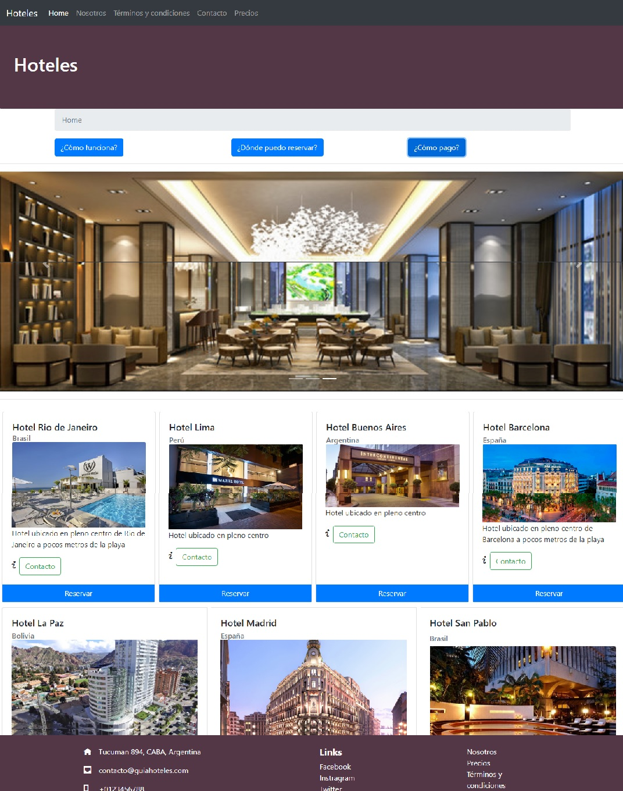
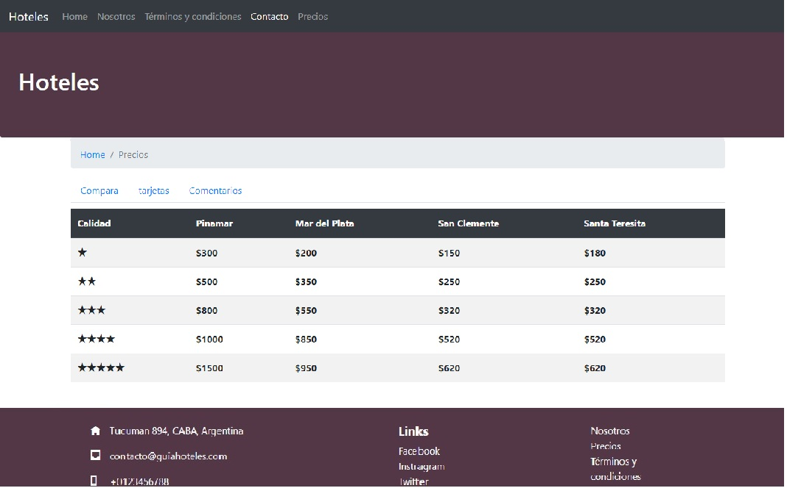
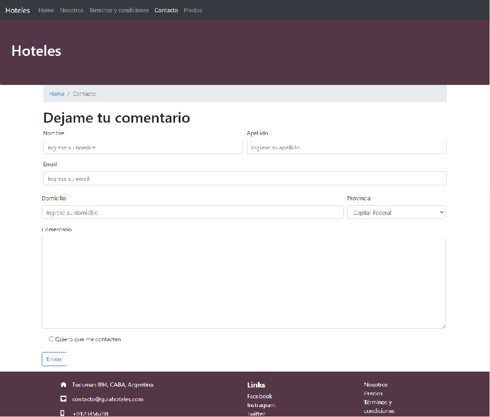
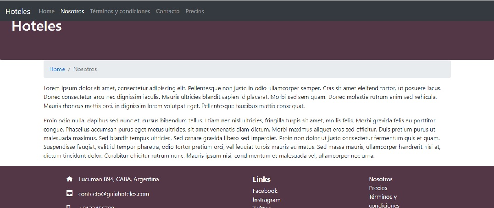

    </img>

# Coursera

## Guia de Hoteles

This is a student project we made as part of our education at [Coursera](https://www.coursera.org), which consisted of creating a full-stack Bootstrap application.

### Our stack of technologies:

- Front End:
    + HTML 
    + CSS  
    + Javascript
    + Bootstrap

- Back End:
    + Node.js

# Previews

### Home page:

</img>

### Precios page:

</img>

### Contact page:

</img>

### About page:

</img>

